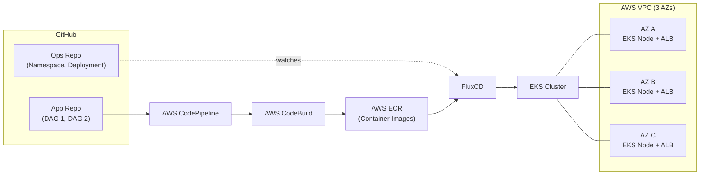

```mermaid
flowchart LR
  %% GitHub sources
  subgraph GitHub["GitHub"]
    app["App Repo<br/>(DAG 1, DAG 2)"]
    ops["Ops Repo<br/>(Namespace, Deployment)"]
  end

  %% CI/CD flow
  app --> cp[AWS CodePipeline]
  cp --> cb[AWS CodeBuild]
  cb --> ecr["AWS ECR<br/>(Container Images)"]

  %% GitOps with Flux
  ops -.->|watches| flux[FluxCD]
  ecr --> flux
  flux --> k8s[EKS Cluster]

  %% Networking
  subgraph VPC["AWS VPC (3 AZs)"]
    direction LR
    aza["AZ A<br/>EKS Node + ALB"]
    azb["AZ B<br/>EKS Node + ALB"]
    azc["AZ C<br/>EKS Node + ALB"]
  end

  k8s --- aza
  k8s --- azb
  k8s --- azc

```
