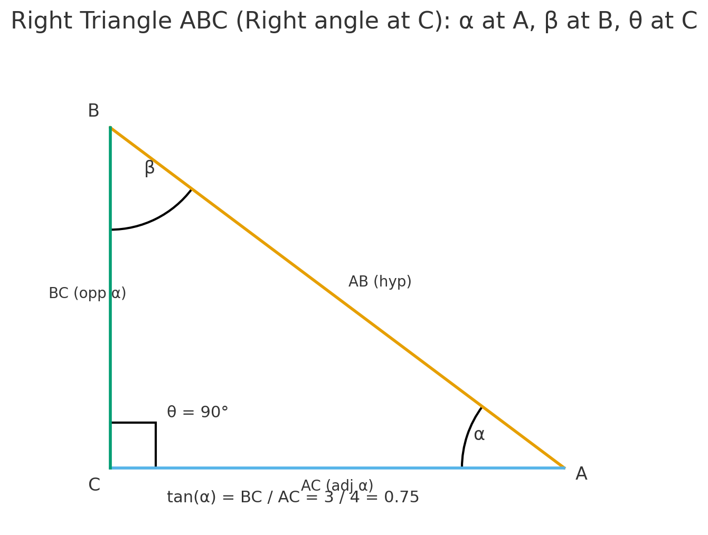

# trigonometry basics

We have a right triangle ABC, vertex at C is the right angle

- AB is the hypotenuse
- angle at A is alpha
- angle at B is beta
- angle at C is teta (right angle)

## Formulas :

- sin of alpha = opposite side of alpha / hypotenuse
  sin of alpha = BC/AB
- cos of alpha = adjacent side of alpha / hypotenuse
  cos of alpha = AC/AB
- tan of alpha = opposite side of alpha / adjacent side of alpha
  tan alpha = sin of alpha x AB / cos of alpha x AB
  tan alpha = sin of alpha / cos of alpha

## Formulas ++

- 180 (°) = pi (radian)
- so 90 (°) = pi/2 (radian) and so fourth

- Note: those values are in radians

# exponenciacion basico 
- exp(1) <=> e¹ = 2.718281828459045
- exp(0) <=> e⁰ = 1
- log(x) <=> logaritmo natural de x (base e)
- log(x, base) <=> logaritmo de x en la base especificada
- log(e) <=> ln(e) = 1
- log(e, e) <=> log_e(e) = 1
- log(1) <=> ln(1) = 0
- exp(log(x)) <=> x
- x * log(x) <=> log(x^x) 